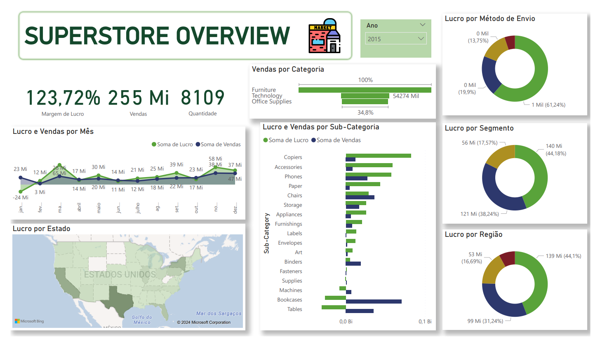

# Análise de Vendas de E-commerce

### Objetivo do Projeto
Esse projeto visa fornecer insights sobre a performance de vendas do e-commerce Superstore. Ao analizar diversos aspectos dos dados de vendas, podemos identificar tendências, fazer recomendações baseadas em dados, e ganhar um maior entendimento sobre a performance da empresa.
### Fonte de Dados
- [Dataset Kaggle: Superstore](https://www.kaggle.com/datasets/vivek468/superstore-dataset-final)
### Ferramentas
- Python - Limpeza de Dados
- SQL - Análise de Dados, Queries, Sub-Queries
- Power BI - Visualização de Dados, DAX, Medidas Rápidas, Filtros,

### Limpeza/Preparação de Dados
Nas etapa inicial de preparação dos dados, realizamos as seguintes tarefas:

1. Upload e inspeção dos dados
2. Tratamento de valores nulos e duplicados
3. Formatação dos dados

### Análise Exploratória de Dados (EDA)
Foi realizado o processo de EDA para responder perguntas como:

- Quanto foi o total de vendas e lucro por trimestre
- Quais cidades e estados que trazem as maiores vendas e lucros? E as piores vendas?
- Quais foram as categorias de produtos com as maiores margens de lucro?
- Quais são os clientes mais assíduos?

### Modelagem
 Não foi necessário realizar nenhum processo adicional de modelagem, uma vez que os dados fornecidos no arquivo CSV já estavam formatados e estruturados de maneira adequada para análise
 
### Análise de Dados
A segui um exemplo de query realizado no projeto ( disponível no arquivo superstore_analysis.ipynb para responder as perguntas de negócios. O resultado nos fornece o lucro e vendas por trimestre:
```
query = '''SELECT
  quarter,
  SUM(total_sales) AS total_sales,
  SUM(total_profit) AS total_profit
FROM (
    SELECT
      CASE
        WHEN STRFTIME('%m', "Order Date") IN ('01','02','03') THEN 'Q1'
        WHEN STRFTIME('%m', "Order Date") IN ('04','05','06') THEN 'Q2'
        WHEN STRFTIME('%m', "Order Date") IN ('07','08','09') THEN 'Q3'
        ELSE 'Q4'
      END AS quarter,
      SUM(Sales) AS total_sales,
      SUM(Profit) AS total_profit
    FROM Superstore
    GROUP BY quarter
) AS quarters
GROUP BY quarter
ORDER BY quarter;
'''
result = query_executer(query)
result
```
### Visualização de Dados

Foi criado um painél no Power BI que permite visualizar:
- Margem de Lucro
- Vendas
- Quantidade de Unidades Vendidas
- Lucro e Vendas por Mês
- Lucro por Estado
- Vendas por Categoria e Sub-Categoria
- Lucro por Método de Envio, Segmento e Região
  
  


